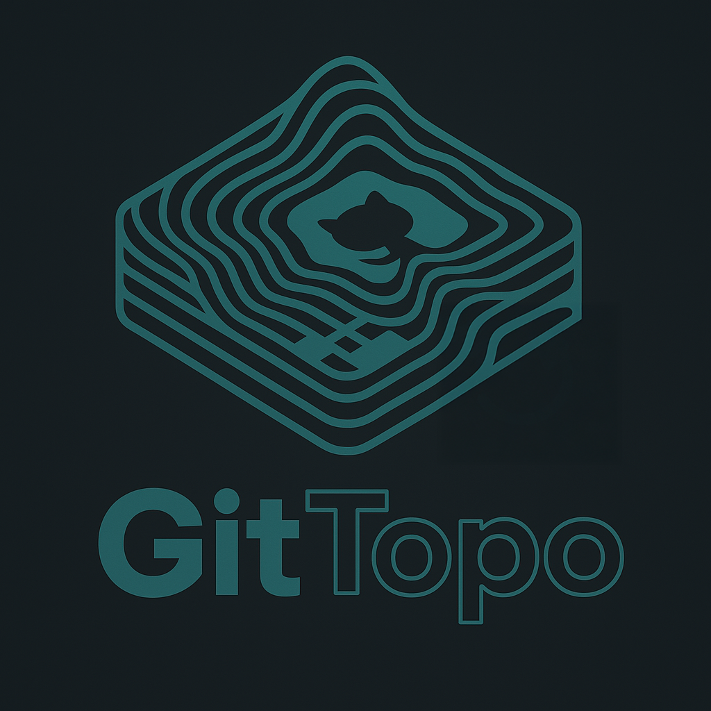

# GitTopo



**GitTopo** is an interactive 3D visualization tool that transforms your GitHub contribution graph into a rotating topographical map. Built with Three.js, it offers a sleek dark/light theme toggle, dynamic color gradients, tooltips, and the ability to export your map as a PNG. Explore your coding activity like never before!

## Features
- **3D Topographical Map**: Visualize your GitHub contributions as a rotatable 3D surface.
- **Color Gradients**: Contributions are color-coded from green (low activity) to red (high activity).
- **Tooltips**: Hover over the map to see exact contribution counts for specific days.
- **Export Option**: Save your map as a PNG image with a single click.
- **Theme Switch**: Toggle between dark and light modes for a comfortable viewing experience.
- **Custom Input**: Enter any GitHub username to generate a personalized map.

## Demo

!(https://makalin.github.io/GitTopo/)

For now, imagine a 3D grid where peaks represent your busiest coding days, smoothly rotating under your control.

## Installation

### Prerequisites
- A modern web browser (e.g., Chrome, Firefox).
- An internet connection (for CDN-hosted dependencies).
- (Optional) A GitHub API token for real data fetching (see [Future Improvements](#future-improvements)).

### Steps
1. **Clone the Repository**:
   ```bash
   git clone https://github.com/makalin/GitTopo.git
   cd GitTopo
   ```

2. **Open the Project**:
   - Simply open `index.html` in your browser. No server is required for the basic version since dependencies are loaded via CDN.
   - Alternatively, use a local development server (e.g., with VS Code’s Live Server extension) for a smoother experience.

3. **Dependencies**:
   - The project uses CDN-hosted libraries:
     - [Three.js](https://threejs.org/) (v134)
     - [OrbitControls](https://threejs.org/docs/#examples/en/controls/OrbitControls) (v134)
   - No additional installations are needed unless you extend the project (e.g., with a backend for API calls).

## Usage
1. **Enter a GitHub Username**:
   - Type a GitHub username into the input field (e.g., "octocat").
   - Click "Generate Map" to create the 3D visualization.

2. **Interact with the Map**:
   - **Rotate**: Click and drag to spin the map.
   - **Zoom**: Scroll to zoom in or out.
   - **Hover**: Move your mouse over the map to see contribution details via tooltips.

3. **Customize**:
   - Click "Toggle Theme" to switch between dark and light modes.
   - Click "Export as PNG" to download the current view.

4. **Explore**:
   - The demo uses simulated data. For real GitHub data, see [Future Improvements](#future-improvements).

## Project Structure
```
GitTopo/
├── index.html    # Main HTML file
├── styles.css    # Styling for layout and themes
├── script.js     # Core logic (Three.js, data handling, enhancements)
└── README.md     # This file
```

## How It Works
- **Data**: Currently uses simulated contribution data (52 weeks × 7 days). In practice, it would fetch real data via the GitHub API.
- **Rendering**: Three.js creates a 3D plane where the Z-axis represents contribution counts, with vertex colors for gradients.
- **Interactivity**: OrbitControls enable rotation, raycasting powers tooltips, and the renderer’s canvas is exported as PNG.

## Future Improvements
- **Real GitHub API Integration**: Fetch actual contribution data using the GitHub GraphQL API. Requires a backend proxy (e.g., Node.js) and an API token due to CORS restrictions.
- **Legend**: Add a color scale to explain the gradient.
- **Animations**: Introduce subtle height animations for a dynamic effect.
- **Mobile Optimization**: Enhance responsiveness for smaller screens.
- **Data Filters**: Allow users to select specific time ranges or repositories.

## Contributing
Feel free to fork this project and submit pull requests! Ideas for new features or bug fixes are welcome. Please open an issue first to discuss your changes.

## License
This project is licensed under the MIT License. See [LICENSE](LICENSE) for details. *(Add a LICENSE file if you choose to include one.)*

## Acknowledgments
- Built with [Three.js](https://threejs.org/), an amazing library for 3D graphics.
- Inspired by GitHub’s contribution graph and a love for interactive visualizations.
